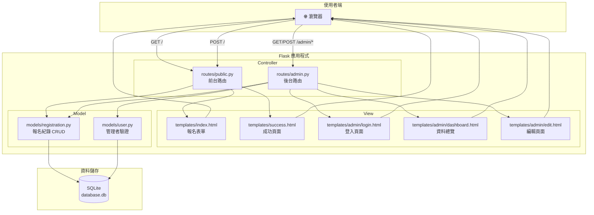
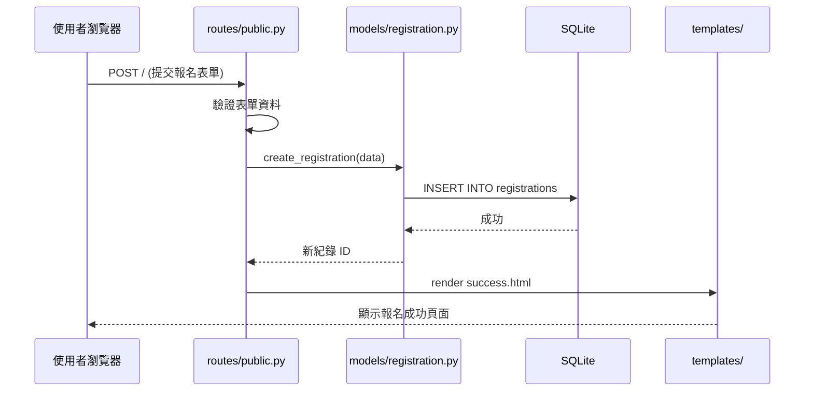

# 活動報名系統 — 系統架構設計

> **版本**：v1.0  
> **建立日期**：2026-04-23  
> **對應 PRD**：docs/PRD.md  

---

## 1. 技術架構說明

### 1.1 選用技術與原因

| 技術 | 用途 | 選用原因 |
|------|------|----------|
| **Python 3** | 程式語言 | 語法簡潔易學，適合快速開發 Web 應用 |
| **Flask** | 後端框架 | 輕量級微框架，學習門檻低，彈性高，適合中小型專案 |
| **Jinja2** | 模板引擎 | Flask 內建支援，可在 HTML 中嵌入 Python 邏輯，實現伺服器端渲染（SSR） |
| **SQLite** | 資料庫 | 零配置、單檔案資料庫，無需額外安裝，適合小型應用 |
| **HTML + CSS + JS** | 前端 | 標準 Web 技術，用於頁面結構、樣式與互動（如表單條件邏輯） |

### 1.2 Flask MVC 模式說明

本專案採用 **MVC（Model-View-Controller）** 架構模式，將程式碼依職責分層：

```
┌─────────────────────────────────────────────────────────┐
│                      瀏覽器 (Browser)                     │
│                  使用者操作 / 送出表單                      │
└──────────────┬──────────────────────▲────────────────────┘
               │ HTTP Request         │ HTTP Response (HTML)
               ▼                      │
┌──────────────────────────────────────────────────────────┐
│                Controller（Flask Routes）                  │
│                                                          │
│  routes/public.py  ← 前台路由（報名表單、成功頁）           │
│  routes/admin.py   ← 後台路由（登入、總覽、編輯、刪除）     │
│                                                          │
│  職責：接收請求 → 呼叫 Model → 選擇 View → 回傳回應        │
└──────────┬───────────────────────────▲───────────────────┘
           │ 資料操作                    │ 查詢結果
           ▼                            │
┌──────────────────────────┐  ┌────────────────────────────┐
│   Model（資料庫模型）      │  │   View（Jinja2 Templates）  │
│                          │  │                            │
│  models/registration.py  │  │  templates/index.html      │
│  models/user.py          │  │  templates/success.html    │
│                          │  │  templates/admin/          │
│  職責：定義資料結構        │  │    login.html              │
│       讀寫 SQLite 資料庫  │  │    dashboard.html          │
│                          │  │    edit.html               │
│                          │  │                            │
│                          │  │  職責：定義頁面 HTML 結構    │
│                          │  │       用 Jinja2 語法        │
│                          │  │       嵌入動態資料          │
└──────────┬───────────────┘  └────────────────────────────┘
           │ SQL 操作
           ▼
┌──────────────────────────┐
│   SQLite Database         │
│                          │
│   instance/database.db   │
│                          │
│   資料表：                │
│   - registrations        │
│   - users (管理者帳號)    │
└──────────────────────────┘
```

**各層職責摘要：**

| 層級 | 對應資料夾 | 職責 |
|------|-----------|------|
| **Model（模型層）** | `app/models/` | 定義資料結構，封裝所有資料庫操作（CRUD） |
| **View（視圖層）** | `app/templates/` | 定義 HTML 頁面結構，使用 Jinja2 動態渲染資料 |
| **Controller（控制層）** | `app/routes/` | 處理 HTTP 請求，協調 Model 與 View，回傳回應 |

---

## 2. 專案資料夾結構

```
web_app_development2/
│
├── docs/                        ← 📄 專案文件
│   ├── PRD.md                   ← 產品需求文件
│   └── ARCHITECTURE.md          ← 系統架構文件（本文件）
│
├── app/                         ← 🏗️ 應用程式主資料夾
│   │
│   ├── __init__.py              ← Flask App 工廠函式（create_app）
│   │
│   ├── models/                  ← 📦 Model 層：資料庫模型
│   │   ├── __init__.py
│   │   ├── registration.py      ← 報名紀錄的 CRUD 操作
│   │   └── user.py              ← 管理者帳號的驗證操作
│   │
│   ├── routes/                  ← 🚦 Controller 層：Flask 路由
│   │   ├── __init__.py
│   │   ├── public.py            ← 前台路由（報名表單、成功頁）
│   │   └── admin.py             ← 後台路由（登入、總覽、編輯、刪除、匯出）
│   │
│   ├── templates/               ← 🎨 View 層：Jinja2 HTML 模板
│   │   ├── base.html            ← 共用基底模板（<head>、導覽列、頁尾）
│   │   ├── index.html           ← 報名表單頁面
│   │   ├── success.html         ← 報名成功頁面
│   │   └── admin/               ← 後台頁面
│   │       ├── login.html       ← 管理者登入頁
│   │       ├── dashboard.html   ← 資料總覽頁（表格 + 統計）
│   │       └── edit.html        ← 編輯報名資料頁
│   │
│   └── static/                  ← 📁 靜態資源
│       ├── css/
│       │   └── style.css        ← 全站樣式表
│       └── js/
│           └── form.js          ← 表單互動邏輯（條件顯示/隱藏欄位）
│
├── instance/                    ← 💾 執行期資料（不進版控）
│   └── database.db              ← SQLite 資料庫檔案
│
├── app.py                       ← 🚀 應用程式入口（啟動伺服器）
├── requirements.txt             ← 📋 Python 套件清單
└── .gitignore                   ← Git 忽略清單
```

### 各檔案用途說明

| 檔案 / 資料夾 | 用途 |
|---------------|------|
| `app.py` | 程式入口點，匯入 `create_app()` 並啟動 Flask 開發伺服器 |
| `app/__init__.py` | Flask App 工廠函式，負責初始化應用程式、註冊 Blueprint、設定資料庫 |
| `app/models/registration.py` | 報名紀錄的資料模型，封裝新增、查詢、更新、刪除等操作 |
| `app/models/user.py` | 管理者帳號模型，封裝密碼驗證（使用雜湊比對） |
| `app/routes/public.py` | 前台 Blueprint，處理 `/`（報名表單）和 `/success`（成功頁） |
| `app/routes/admin.py` | 後台 Blueprint，處理 `/admin/*` 相關路由（登入、登出、總覽、編輯、刪除、匯出） |
| `app/templates/base.html` | Jinja2 基底模板，定義 HTML 共用結構，其他頁面透過 `` 繼承 |
| `app/static/css/style.css` | 全站 CSS 樣式，包含 RWD 響應式設計 |
| `app/static/js/form.js` | 前端 JavaScript，處理表單欄位的動態顯示/隱藏邏輯 |
| `instance/database.db` | SQLite 資料庫檔案，儲存所有報名紀錄與管理者帳號 |
| `requirements.txt` | 列出專案所需的 Python 套件（Flask 等） |

---

## 3. 元件關係圖

以下使用 Mermaid 語法繪製系統元件之間的資料流動：



### 請求處理流程（以報名為例）



---

## 4. 關鍵設計決策

### 決策一：使用 Flask Blueprint 組織路由

**決策**：將前台路由（`public.py`）與後台路由（`admin.py`）分為不同的 Blueprint。

**原因**：
- 職責清晰：前台面向一般用戶，後台面向管理者，邏輯分開維護
- 方便為後台路由統一加上登入驗證的裝飾器
- 後台路由統一使用 `/admin` 前綴，URL 結構清楚

---

### 決策二：使用 App Factory 模式（`create_app()`）

**決策**：在 `app/__init__.py` 中使用工廠函式建立 Flask 實例。

**原因**：
- Flask 官方推薦做法，避免全域變數造成的測試困難
- 可依環境（開發/測試/生產）傳入不同設定
- 方便未來擴展

---

### 決策三：密碼使用 Werkzeug 雜湊儲存

**決策**：管理者密碼使用 `werkzeug.security.generate_password_hash()` 與 `check_password_hash()` 處理。

**原因**：
- Flask 內建 Werkzeug，無需額外安裝套件
- 雜湊儲存確保即使資料庫洩露，密碼也無法被還原
- 符合基本資安要求

---

### 決策四：使用 Flask Session 管理登入狀態

**決策**：管理者登入後，將身份資訊存入 Flask 的 `session` 物件。

**原因**：
- Flask 內建 session 機制，基於加密的 Cookie，簡單安全
- 不需要額外安裝認證套件（如 Flask-Login），降低專案複雜度
- 搭配裝飾器即可實現路由保護

```python
# 登入驗證裝飾器範例
from functools import wraps
from flask import session, redirect, url_for

def login_required(f):
    @wraps(f)
    def decorated_function(*args, **kwargs):
        if 'admin_logged_in' not in session:
            return redirect(url_for('admin.login'))
        return f(*args, **kwargs)
    return decorated_function
```

---

### 決策五：使用原生 `sqlite3` 模組操作資料庫

**決策**：直接使用 Python 內建的 `sqlite3` 模組，不使用 ORM（如 SQLAlchemy）。

**原因**：
- 本專案資料表簡單（僅 2 張表），使用 ORM 反而增加學習成本
- 原生 SQL 操作更直觀，適合初學者理解資料庫原理
- 減少套件依賴，部署更簡單

---

## 5. 套件依賴

```
# requirements.txt
Flask>=3.0
```

> 📌 由於使用原生 `sqlite3` 與 Werkzeug（Flask 內建），無需額外安裝其他套件。

---

> 📌 本文件為系統架構設計初版。確認後即可進入流程圖設計（`/flowchart`）與資料庫設計（`/db-design`）階段。
