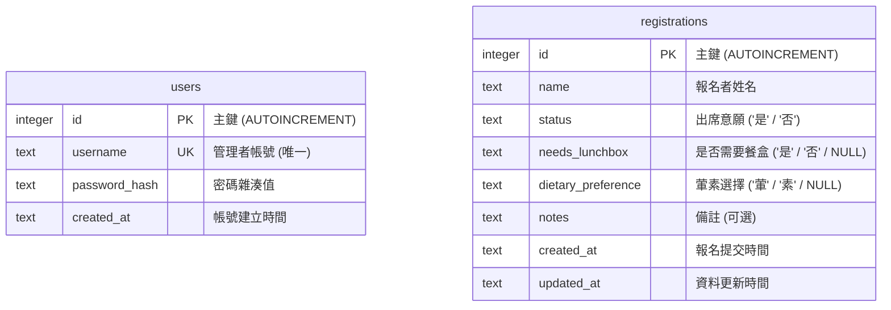

# 活動報名系統 — 資料庫設計文件

> **版本**：v1.0  
> **建立日期**：2026-05-21  
> **對應文件**：[PRD.md](file:///c:/Users/User/web_app_development2/docs/PRD.md)、[FLOWCHART.md](file:///c:/Users/User/web_app_development2/docs/FLOWCHART.md)、[ARCHITECTURE.md](file:///c:/Users/User/web_app_development2/docs/ARCHITECTURE.md)  

---

本文件提供「活動報名系統」的資料庫設計詳情，包含 ER 圖、資料表定義、SQL 建表語法（SQLite 語法）以及對應的 Python Model CRUD 設計說明。

## 1. 實體關係圖（ER Diagram）

系統包含兩張獨立的資料表：
- `registrations`：儲存一般用戶提交的活動報名資料。
- `users`：儲存後台管理者的帳號及雜湊密碼。



---

## 2. 資料表詳細說明

### 2.1 `registrations` 表 (活動報名紀錄)

儲存每位報名者的詳細資訊與餐盒偏好。

| 欄位名稱 | 資料型別 | 鍵/約束 | 預設值 | 允許空值 | 說明 |
| :--- | :--- | :--- | :--- | :---: | :--- |
| `id` | `INTEGER` | PK, AI | | ❌ | 報名紀錄唯一的識別碼 |
| `name` | `TEXT` | | | ❌ | 報名者姓名 |
| `status` | `TEXT` | CHECK | | ❌ | 出席意願，僅限 `'是'`、`'否'` |
| `needs_lunchbox` | `TEXT` | CHECK | | ⭕ | 是否需要餐盒，值為 `'是'`、`'否'`。當 `status='是'` 時填寫 |
| `dietary_preference`| `TEXT` | CHECK | | ⭕ | 葷素選擇，值為 `'葷'`、`'素'`。當 `needs_lunchbox='是'` 時填寫 |
| `notes` | `TEXT` | | | ⭕ | 備註，可選填 |
| `created_at` | `TEXT` | | `datetime('now', 'localtime')` | ❌ | 報名建立時間 (ISO 格式或 Local Time 字串) |
| `updated_at` | `TEXT` | | `datetime('now', 'localtime')` | ❌ | 報名資料最後修改時間 |

*註：`status`、`needs_lunchbox`、`dietary_preference` 在資料庫層級加上了 `CHECK` 約束，以確保資料格式正確。*

### 2.2 `users` 表 (管理者帳號)

儲存用於登入後台的管理者資訊。

| 欄位名稱 | 資料型別 | 鍵/約束 | 預設值 | 允許空值 | 說明 |
| :--- | :--- | :--- | :--- | :---: | :--- |
| `id` | `INTEGER` | PK, AI | | ❌ | 管理者唯一識別碼 |
| `username` | `TEXT` | UNIQUE, Not Null | | ❌ | 管理者登入帳號（不可重複） |
| `password_hash` | `TEXT` | | | ❌ | 經過 Werkzeug 安全雜湊加密後的密碼字串 |
| `created_at` | `TEXT` | | `datetime('now', 'localtime')` | ❌ | 帳號建立時間 |

---

## 3. SQL 建表語法

建表語法儲存於 [schema.sql](file:///c:/Users/User/web_app_development2/database/schema.sql)。

```sql
-- database/schema.sql
PRAGMA foreign_keys = ON;

DROP TABLE IF EXISTS registrations;
DROP TABLE IF EXISTS users;

-- 建立報名紀錄表
CREATE TABLE registrations (
    id INTEGER PRIMARY KEY AUTOINCREMENT,
    name TEXT NOT NULL,
    status TEXT NOT NULL CHECK(status IN ('是', '否')),
    needs_lunchbox TEXT CHECK(needs_lunchbox IN ('是', '否')),
    dietary_preference TEXT CHECK(dietary_preference IN ('葷', '素')),
    notes TEXT,
    created_at TEXT NOT NULL DEFAULT (datetime('now', 'localtime')),
    updated_at TEXT NOT NULL DEFAULT (datetime('now', 'localtime'))
);

-- 建立管理者帳號表
CREATE TABLE users (
    id INTEGER PRIMARY KEY AUTOINCREMENT,
    username TEXT NOT NULL UNIQUE,
    password_hash TEXT NOT NULL,
    created_at TEXT NOT NULL DEFAULT (datetime('now', 'localtime'))
);
```

---

## 4. Python Model 實作說明

每個資料表在 `app/models/` 有其對應的 Model 實作，透過原生的 `sqlite3` 與 Flask 的請求上下文進行資料操作。

### 4.1 資料庫連線管理 ([app/db.py](file:///c:/Users/User/web_app_development2/app/db.py))

提供 `get_db()` 取得資料庫連線，並利用 Flask 內建的 `g` 物件進行連線共享與自動關閉。
同時註冊 `flask init-db` CLI 指令，方便一鍵初始化資料庫。

### 4.2 報名紀錄 Model ([app/models/registration.py](file:///c:/Users/User/web_app_development2/app/models/registration.py))

提供以下 CRUD 方法：
- `create(name, status, needs_lunchbox, dietary_preference, notes)`: 新增報名紀錄。
- `get_all()`: 取得所有報名紀錄（依時間降序排列）。
- `get_by_id(id)`: 查詢單筆報名紀錄。
- `update(id, name, status, needs_lunchbox, dietary_preference, notes)`: 修改報名資料，更新 `updated_at` 時間。
- `delete(id)`: 刪除特定報名紀錄。
- `get_stats()`: 查詢報名統計（包括出席人數、餐盒數、葷素比例）。

### 4.3 管理者帳號 Model ([app/models/user.py](file:///c:/Users/User/web_app_development2/app/models/user.py))

提供以下帳密驗證方法：
- `create(username, password)`: 新增管理者（自動將密碼雜湊化）。
- `get_by_username(username)`: 依帳號查詢管理者。
- `verify_user(username, password)`: 驗證帳號密碼是否相符（使用 `check_password_hash`），成功回傳 User 物件。
