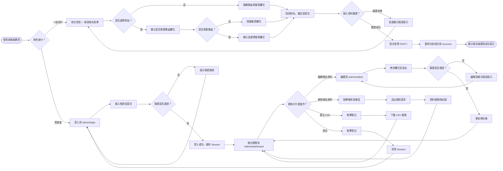
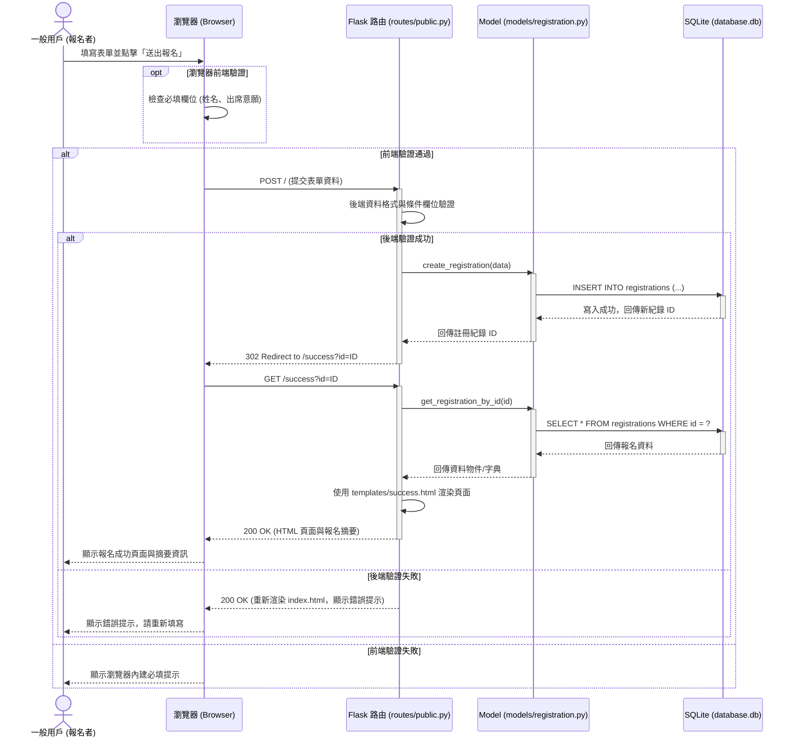
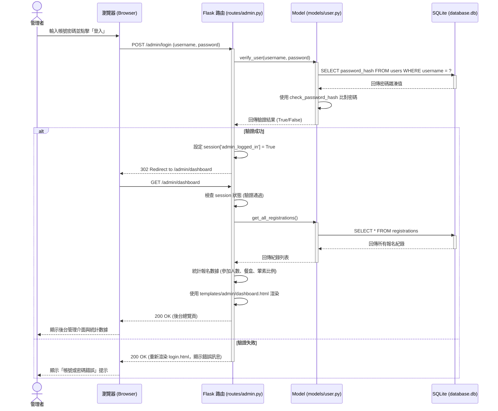
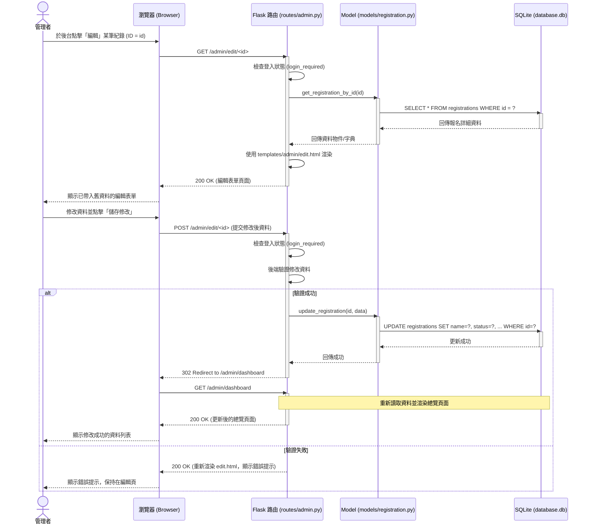

# 活動報名系統 — 流程圖設計文件

> **版本**：v1.0  
> **建立日期**：2026-05-21  
> **對應文件**：[PRD.md](file:///c:/Users/User/web_app_development2/docs/PRD.md)、[ARCHITECTURE.md](file:///c:/Users/User/web_app_development2/docs/ARCHITECTURE.md)  

---

本文件提供「活動報名系統」的流程圖與功能對照表，包含一般報名者與管理者的操作流程，以及前後端系統元件之間的資料流與處理程序。

## 1. 使用者流程圖（User Flow）

使用者流程圖描述了**一般用戶（報名者）**與**後台管理者**在系統中的操作路徑與邏輯分支。

---

## 2. 系統序列圖（Sequence Diagram）

### 2.1 一般用戶：提交報名表單流程

此序列圖描述一般用戶填寫並提交表單，資料通過前端驗證、後端處理、Model 層寫入 SQLite 資料庫，最後跳轉至報名成功頁面的完整流程。

### 2.2 管理者：登入與總覽後台流程

此序列圖描述管理者進行登入驗證、儲存會話（Session）狀態，並載入後台首頁進行數據統計與展現的完整過程。

### 2.3 管理者：編輯報名資料流程

此序列圖描述管理者進入編輯頁面修改報名資料，並儲存更新至資料庫的流程。

---

## 3. 功能清單對照表

本表格列出系統目前規畫的所有功能、對應的 URL 路徑、HTTP 方法及存取權限。

| 功能名稱 | URL 路徑 | HTTP 方法 | 存取權限 | 說明 |
| :--- | :--- | :--- | :--- | :--- |
| **填寫報名表單** | `/` | `GET` | 公開 (所有用戶) | 顯示報名表單頁面，包含姓名、出席意願、餐盒需求與葷素選擇等欄位。 |
| **送出報名表單** | `/` | `POST` | 公開 (所有用戶) | 接收報名資料，驗證條件欄位（如是否需要餐盒與葷素選擇）並寫入資料庫，成功後重導向至成功頁。 |
| **報名成功回饋** | `/success` | `GET` | 公開 (所有用戶) | 顯示報名成功確認訊息，並展示報名資料摘要。 |
| **管理者登入頁** | `/admin/login` | `GET` | 公開 (所有用戶) | 顯示管理者登入介面。 |
| **執行管理者登入** | `/admin/login` | `POST` | 公開 (所有用戶) | 驗證管理者帳密，成功則寫入 session 並重導向至後台總覽頁。 |
| **執行管理者登出** | `/admin/logout` | `POST` / `GET` | 管理者 (登入後) | 清除管理者登入的 session 狀態，並重導向回登入頁。 |
| **後台資料總覽** | `/admin/dashboard`| `GET` | 管理者 (登入後) | 顯示所有報名紀錄表格、出席人數統計、餐盒數量統計、葷素比例統計，並提供編輯、刪除與匯出按鈕。 |
| **編輯報名資料頁**| `/admin/edit/<int:id>`| `GET` | 管理者 (登入後) | 讀取指定 ID 的報名資料，並以編輯表單呈現。 |
| **送出編輯資料** | `/admin/edit/<int:id>`| `POST` | 管理者 (登入後) | 接收修改後的資料，驗證後更新至資料庫，成功則重導向回總覽頁。 |
| **刪除報名資料** | `/admin/delete/<int:id>`| `POST` | 管理者 (登入後) | 刪除資料庫中指定 ID 的報名紀錄，成功後重導向回總覽頁。 |
| **匯出 CSV 檔案** | `/admin/export` | `GET` | 管理者 (登入後) | 將資料庫中所有報名資料生成為 CSV 檔案格式並提供下載。 |

---

> 📌 本流程圖文件已將 PRD 的功能需求與 ARCHITECTURE.md 的專案路由架構完全對接。確認無誤後，即可進入資料庫設計（`/db-design`）與實作階段。
